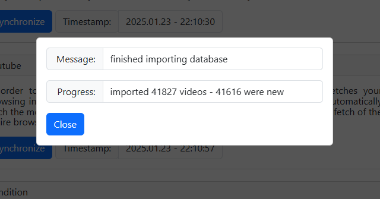

# YouTube Takeout (JSON) to Watchmarker DB

[Youtube Watchmarker](https://github.com/sniklaus/youtube-watchmarker) is an awesome extension for marking youtube videos as watched. The extension stores all the watched videos in a database that can be exported and imported.

When first installing the extension, it is useful to be able to migrate existing watch history data from YouTube. The script in this repository enables you to do this. The script was originally created by [Jeefongithub](https://github.com/Jeefongithub/youtube-takeout-json-to-watchmarker), which was inspired by the HTML version by [janpaul123](https://github.com/janpaul123/youtube-takeout-to-watchmarker). Modifications have been made to support data formats as recent as 2025/01.

## Features

- Convert all video watch history (on www.youtube.com and music.youtube.com)
- Skips all non-video history (website visits, ads, community post etc)
- Available as a web tool & a local tool
- Maintains watch timestamps from YouTube

## Usage

The tool is available both as a webpage (no installation, easy) and a Node.JS script (requires Node.JS installation). They do not have any feature disparity and run based on the same conversion code (seen in `convert.js`).

Privacy: The webpage processes your uploaded watch history on-device, and thus the data will never leave your device. If you are concerned, the source code for the webpage can be seen in the `index.html` of this repository. This source code is guaranteed to be the same as the deployed page, which you can also verify by inspecting the CI (GitHub Actions).

### Step 1: Prepare data

1. Export your YouTube Watch History via [Google Takeout](https://takeout.google.com/settings/takeout/custom/youtube). Make sure to select JSON as the watch history export format. To prevent unnecessarily large exports, make sure to deselect all content types but "history".
2. Wait for Takeout to email you the data. Takes a while but usually less than an hour.
3. Extract the `watch-history.json` file.

### Step 2: On the web (Easy)

The tool's been wrapped up into a basic webpage, which you can access [here](https://yutotakano.github.io/youtube-takeout-json-to-watchmarker/).

1. Upload the `watch-history.json` file and press convert
2. After a successful conversion, the converted file will be downloaded to your device.
3. Any errors will be shown on the web page. If any of the errors are unexpected, please file [a bug report](https://github.com/yutotakano/youtube-takeout-json-to-watchmarker/issues).

### Alternative Step 2: Run locally

If for some reason you would like to run the conversion locally or as part of another tool, follow these steps:

1. Install Node.JS (not too old, but should work with any recent version -- tested on LTS 22.13.1)
2. Place the `watch-history.json` file next to convert.js
3. Run `node convert.js`, which will generate "watch-history.converted.database"
